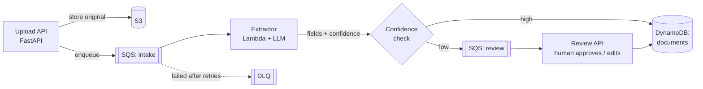

# DocumentIntake
LLM-powered invoice extraction pipeline on AWS (FastAPI, SQS, Lambda, DynamoDB) with idempotent retries and human review for low-confidence results. Work in progress.

# Document Intake Agent

An LLM-powered pipeline that turns messy invoices (PDFs and emails) into clean, structured data, and sends anything it isn't sure about to a human for review.

> **Status: in progress (started October 2026).** This README describes the design and the build plan. Sections are marked ✅ when done and ⏳ when planned.

## Why

Finance and operations teams still re-type invoice data by hand. Documents come in different layouts, as scanned PDFs or email bodies, and a single wrong field (amount, due date, vendor) causes real downstream problems. This project explores how to automate that work reliably:

- **Extract** structured fields with an LLM instead of brittle templates.
- **Know when it's unsure.** Every field gets a confidence score, and low-confidence documents go to a human review queue instead of flowing through silently.
- **Never process a document twice.** The pipeline is event-driven with retries, so every step is idempotent.

## Architecture

**Flow**

1. A client uploads an invoice (PDF or raw email) to the **FastAPI** upload endpoint.
2. The original file is stored in **S3**, and a message with the document ID is put on the **intake SQS queue**.
3. An **extractor Lambda** reads the document, calls an **LLM API** with a strict output schema, and validates the result (types, totals add up, dates parse).
4. Each field gets a confidence score. If every required field passes its threshold, the record is written to **DynamoDB**. Otherwise it goes to the **review queue**.
5. A reviewer approves or corrects the fields through the **review API**, and the final record is saved.
6. Messages that keep failing land in a **dead-letter queue** for inspection.

## Reliability design

| Concern | Approach |
|---|---|
| Duplicate messages (SQS is at-least-once) | Idempotency key per document; conditional writes in DynamoDB so a repeated message is a safe no-op |
| Transient LLM or network failures | Retries with exponential backoff; dead-letter queue after N attempts |
| Partial failures mid-pipeline | Each step records its state; a retried step resumes from the last committed state |
| Bad LLM output | JSON schema validation and business-rule checks before anything is saved |
| Silent errors | Low-confidence results always go to human review, never straight through |

## Extracted fields (v1)

`vendor_name`, `invoice_number`, `invoice_date`, `due_date`, `currency`, `subtotal`, `tax`, `total`, `line_items[]` (description, quantity, unit price, amount).

## Tech stack

- **API:** Python, FastAPI
- **Cloud:** AWS Lambda, SQS (with DLQ), DynamoDB, S3
- **AI:** LLM API with structured (JSON schema) output
- **Infra:** Infrastructure as code (planned)
- **Testing:** pytest, with a labelled evaluation set of public sample invoices

## Build plan

- ⏳ Repo setup, README, architecture
- ⏳ Upload API and S3 storage
- ⏳ SQS intake queue and extractor Lambda
- ⏳ LLM extraction with schema validation
- ⏳ Confidence scoring and the human review queue
- ⏳ Idempotency keys, retries and dead-letter queue
- ⏳ Evaluation set and accuracy report (per-field precision)
- ⏳ Deployed demo and short walkthrough video

## Evaluation (planned)

Accuracy will be measured on a hand-labelled set of public sample invoices, per field. Results go here once real runs exist; no numbers are claimed before then.

## Data

Only public sample invoices are used. No real customer or personal data.

## Author

**Hima Gayatri Gunda** · Backend engineer (Java, Python, AWS)
[LinkedIn](https://www.linkedin.com/in/himagayatrigunda07/) · [GitHub](https://github.com/himagayatrig-07)
